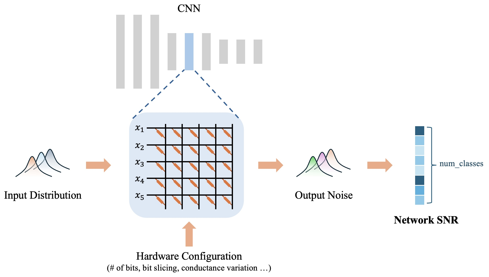

# compute-in-memory-accuracy
A statistical modeling framework that estimates accuracy degradation of CIM accelerators using per-layer input distributions derived from a target dataset.



## Running Noise Estimation
The tool provides automated code for estimating output noise of ResNet-18 on the ImageNet dataset.  
The analog compute core supports flexible hardware configurations, including:

- Input/weight quantization (bit width, scale, zero point)
- Input/weight slicing
- Weight encoding (differential or offset subtraction)
- ReRAM device variation
- ADC thermal noise

Per-layer hardware parameters can be defined by modifying `noise-estimation/resnet/noise_resnet.py`, referring to the analog core logic in `noise-estimation/utils/analog_core_simulator.py`.

The automated noise estimation code allows users to define specific design parameters to sweep and obtain noise estimates for either the first convolution layer (`conv1`) or the final output layer (`fc`) using our tool:

#### First-Layer Noise Estimation (`conv1`)
- Ensure the ImageNet directory `../val` exists (see line 96 of `test_first_layer.py`). 
- Generate `noise-estimation/resnet/stat.pkl` via input activation probing. Edit `params_sweep_list_raw` in `test_first_layer.py`, then run:

```bash
python noise-estimation/test_first_layer.py
```
  
#### Output Layer Noise Estimation (`fc`)
- Ensure the ImageNet directory `../val` exists.
- Generate `stat.pkl` and `noise_prop.pkl` via input activation and noise propagation probing.
- Edit `params_sweep_list_raw` in `test_resnet.py`, then run:
   ```bash
   python noise-estimation/test_resnet.py
   ```
Results from both will be saved to `noise-estimation/results`.

## Calibrating Quantization Ranges

We use a modified Cross-Sim optimizer to find the optimal quantization ranges for any given design.

To generate calibrated ranges, first modify the design configurations in `calibration/calibrate_inputs.py` and in `calibration/calibrate_adcs.py`. Then run them in the following order:

```
python calibration/calibrate_inputs.py
python calibration/calibrate_adcs.py
```

The ranges will be stored in `.npy` files in the `calibration/calibrated_config` folder. ADC ranges must be calibrated for different crossbar topologies (weight bit slicing, differential vs balanced, etc). Lines `67-69` in `calibration/calibrate_adcs.py` contains the permutations that are modifiable by the user.

## Cross-Sim Validation (SNR)
Before starting, make sure that the `val_dir` points to the validation director on the local machine. Also, tune `N` (number of images for inference) as you see fit. 
To run a cross-sim SNR validation experiment, run the following files in order:

```
python3 batch_snr.py
```
This will generate a series of folders labelled with different permutations of cross-bar properties (weight bit, input bit, etc) and within those folders the SNR of the ground truth first and last layer output activations from resnet-18 against the corresponding noisy tensors from the analog kernel by cross-sim. 
Lines `70-77` describe the permutations of the cross-bar array. Some permtuations require corresponding calibrated ADCs, so it is most ideal to copy over the same set of permutations into `calibration/calibrate_adcs.py` and start with the adc range npy files before running the experiment.


## Input Activation Distribution Probing

Our tool accepts as an input a statistical distribution of the input activations for each layer.
This data depends only on the DNN architecture and the dataset, so it does not need to be rerun for each new hardware configuration.
The current script is set up to collect data for ResNet18 with the ImageNet100 dataset, because that is what we used for our validation and experiments.
To collect the data first set the number of images considered `N` at the beginning of the code and then run

```
python inference_resnet18_all_layers.py
```

The data will be stored in `probing_data.pkl` in the form of a dictionary.
The keys of the dictionary are in the form `<layer name>.in` for the input activations pdf, `<layer name>.out` for the outputs pdf, and `in_zp`, `in_scale`, `adc_zp`, `adc_scale` for the calibrated quantization configuration (the quantization ranges calibration needs to be run separately prior to this).


## Noise Propagation Probing

If running the tool on the whole network it is required to provide data about how noise propagates from each channel to the output.
Similarily to input activation probing the script is set up to use ResNet18 and ImageNet100.
This data can be collected by running:

```
python inference_resnet18_noise_prop.py
```

The code simulates noise propagation by applying Gaussian noise to each channel and seeing how it affects the output.
The number of noise samples ran on each channel, which is also the number of images used, can be configured by setting the value of `N` at the top of the code.
The result will be saved in `noise_prop.pkl` in the form of a dictionary with keys for each layer name and values in the form of tensors of shape `(<number of channels>, <size of output>)` which contains in each cell the ratio of variance at the output to variance applied at a given channel of the given layer. 
